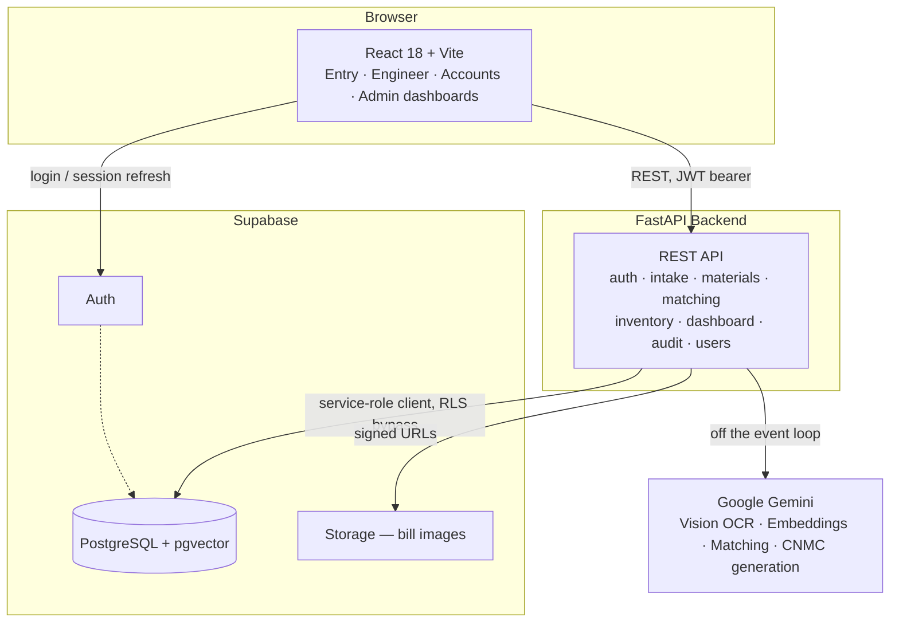

<div align="center">


# Saarthi — Unified Material Master

**One Nation. One Material Code.**

An AI-powered platform that standardizes, deduplicates, and intelligently manages
material master data across departments of a public-sector enterprise — built and
demonstrated against a simulated Indian oil & gas company, **BharatOil**.

[](./progress.md)
[](#)

</div>

<div align="center">


</div>

---

## What is Saarthi?

Large public-sector enterprises accumulate the same material under dozens of
different codes and descriptions — one department's "Hex Bolt M8x25 SS304" is
another's "S.S Hexagonal Bolt 8mm 25mm Length." That drift costs real money in
duplicate procurement and makes stock impossible to search reliably.

Saarthi gives every material **one canonical code** — the **Common National
Material Code (CNMC)** — generated and deduplicated automatically as stock comes
in, so four different roles can all trust the same catalog:

| Role | What they do in Saarthi |
|---|---|
| 🧾 **Entry Operator** | Scans a bill or a barcode; Saarthi extracts, classifies, and matches every line against the existing catalog before it's confirmed into stock |
| 🔧 **Engineer** | Finds materials by natural-language question, browses the catalog, checks live stock by bin |
| 💰 **Accounts** | Compares vendor pricing, values stock, tracks purchase history and savings opportunities |
| 🛡️ **Admin** | Governs the material master — approves, deprecates, merges duplicates — and reviews a full audit trail |

## How intake works

```
   📷 Bill photo / barcode
          │
          ▼
   Gemini Vision OCR  ──────►  structured line items
          │
          ▼
   pgvector similarity search over the existing catalog
          │
          ├── confident match ──────► linked to the existing material
          │
          └── no confident match ──► Gemini proposes a CNMC + classification
                                              │
                                              ▼
                                   operator reviews & confirms
                                              │
                                              ▼
                          one transaction: material · stock · price history · audit
```

Every write from a confirmed receipt or an approved duplicate merge happens as a
**single database transaction** — nothing is half-saved if a step fails.

## Architecture



The frontend never talks to Postgres directly — every read and write for business
data goes through the FastAPI backend, which is the single place role checks,
validation, and audit logging happen. The browser only talks to Supabase directly
for authentication.

## Tech stack

| Layer | Technology |
|---|---|
| Frontend | React 18, Vite, Tailwind CSS, Radix UI / shadcn, Zustand, TanStack Query, Axios, Recharts |
| Backend | FastAPI (Python 3.11), Pydantic, uvicorn |
| Database | Supabase (PostgreSQL), pgvector for semantic similarity search |
| Auth & Storage | Supabase Auth (role-based), Supabase Storage (bill images) |
| AI | Google Gemini — Vision OCR, text embeddings, material matching, CNMC generation |
| Barcode scanning | `@zxing/browser` (in-browser webcam decoding) |

## Project structure

```
Saarthi/
├── backend/            FastAPI app — routers, services, tests
├── frontend/           React app shell, routing, Entry Operator screens
├── dashboards/         Engineer / Accounts / Admin dashboard screens
├── migrations/         Reviewable, numbered SQL — the source of truth for schema changes
├── schema.sql          Bootstrap schema for a brand-new database
├── demo_assets/        Sample bills and seed data for the BharatOil demo
├── plan.md             The full build plan, phase by phase
└── progress.md         What's actually done, verified, and still open
```

> `dashboards/` currently imports shared pieces (the API client, the header) from
> `frontend/src` across the folder boundary. Folding it into `frontend/src` fully
> is tracked as its own cleanup step rather than done as part of this rename.

## Getting started

**Prerequisites:** Python 3.11+, Node 18+, a Supabase project, a Gemini API key.

```bash
# Backend
cd backend
python -m venv venv && venv/Scripts/activate   # or source venv/bin/activate on macOS/Linux
pip install -r requirements.txt
cp .env.example .env                            # fill in Supabase + Gemini credentials
uvicorn main:app --reload --port 8000

# Frontend (separate terminal)
cd frontend
npm install
cp .env.example .env                            # fill in Supabase URL/anon key, API base URL
npm run dev
```

Open `http://localhost:5173`. Four demo roles are seeded — `admin`, `engineer`,
`accounts`, `entry_operator` — each on its own login.

## Development status

Saarthi is under active development against a bug-by-bug fix plan built from a
full codebase audit, not a feature checklist. **[`progress.md`](./progress.md)**
is the honest, continuously-updated record of what's actually implemented and
verified — including what's still `[~]` (coded but not yet proven live) versus
genuinely `[x]` done. **[`plan.md`](./plan.md)** holds the full phase-by-phase plan.

